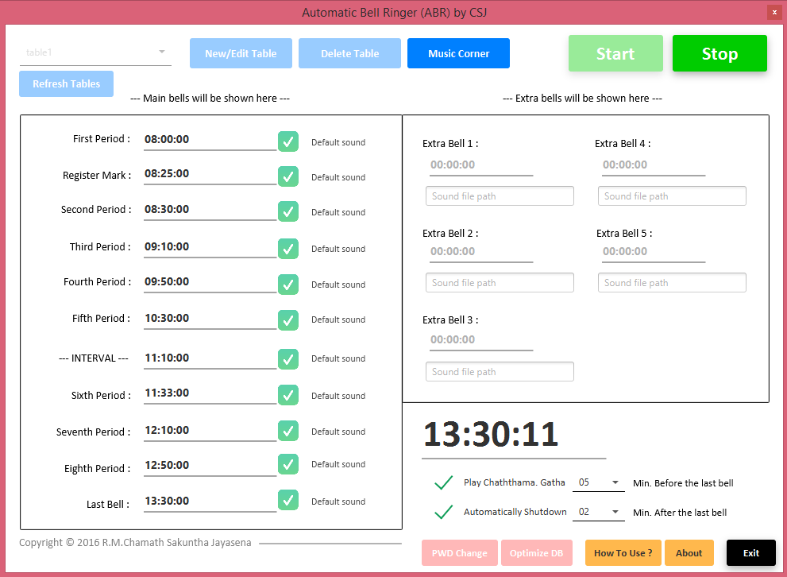
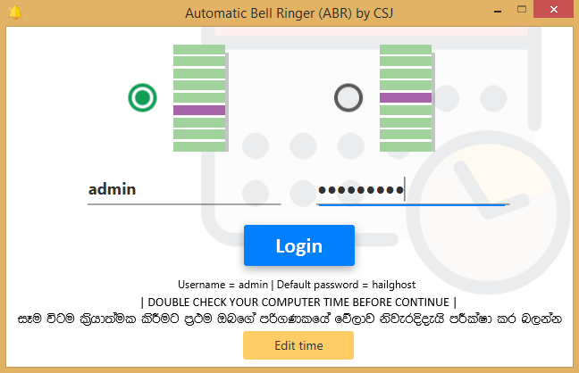
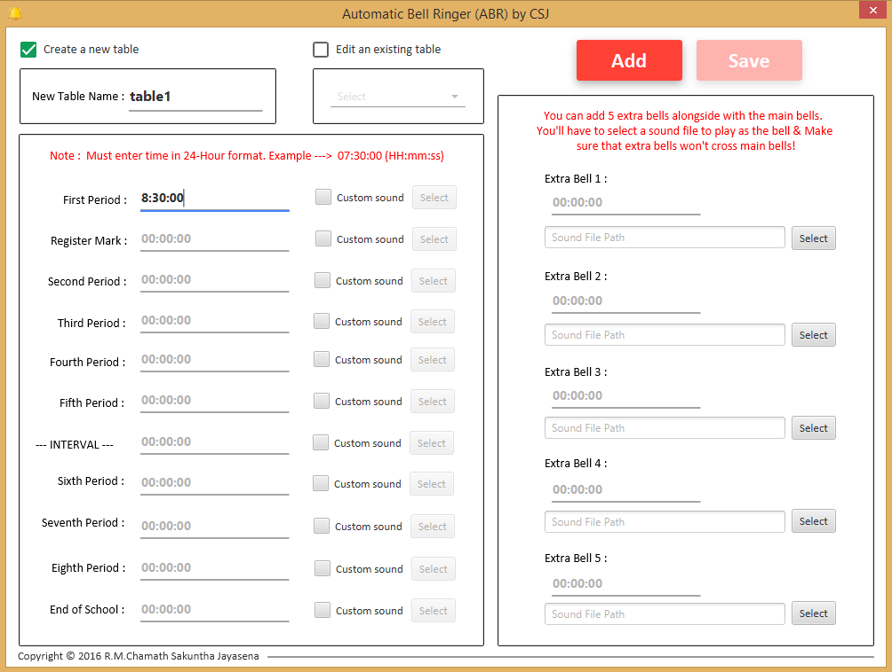
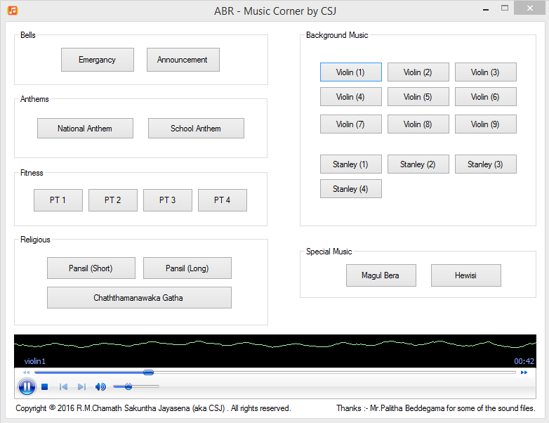

> **⚠️ Note:** The source code will be added soon after a review and cleanup. Once the source code is added, this repository will be archived.

---
# ABR
A desktop application developed to automate the bell scheduling system for schools in the LK Public School System. This software simplifies and streamlines school bell management. Created in 2016 as part of my GCE A-Level individual project.

<p align="center">
  
</p>

## Features
- **User-Friendly Interface:** Intuitive design ensuring ease of use for school administrators and staff.
  
- **Secure User Authentication:** Protects access with robust authentication mechanisms.
  
- **Unlimited Timetables:** Allows creation and management of multiple timetables without restrictions.
  
- **Dedicated Music Corner:** Supports playing various types of audio, including anthems, religious music, and background tracks, tailored for different school events.
  
- **AES-256 Encryption:** Ensures data security using encryption.
  
- **Material Design:** Implements modern and sleek design principles for a visually appealing experience.

## Dependencies
- JFoenix
- SQLite JDBC: v3.8.11.2

## Screenshots
|                   Login                   |                Main Window                 |
| :---------------------------------------: | :----------------------------------------: |
|  |  |
|                                           |                                            |

|              Create/Edit Table              |                Music Corner                 |
| :-----------------------------------------: | :-----------------------------------------: |
|  |  |

## Usage
1. Clone the repository: 

    ```
    git clone https://github.com/chamajay/abr.git
    ```

2. Open the project in Intellij IDEA or other Java IDE.
3. Run the project.

## Acknowledgments
- Palitha Baddegama: Thanks for generously allowing me to use  sound files from your software in my project.
